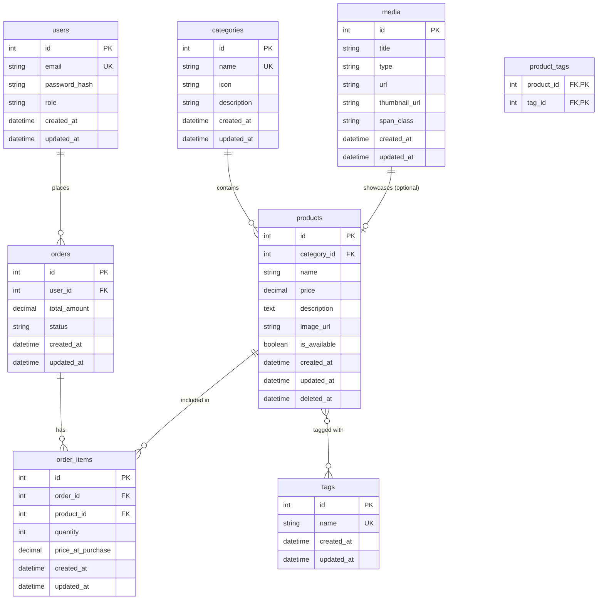

# Entity Relationship Diagram (ERD)

This diagram visualizes the relational structure of the Jasreanna's Place database.

## Relationship Details

### One-to-Many (1:N)
- **Categories ➔ Products**: A category contains multiple products. If a category is deleted, all its products are removed (**CASCADE**).
- **Users ➔ Orders**: A user can place multiple orders. If a user is deleted, their orders remain but the `user_id` is set to **NULL** (for historical tracking).
- **Orders ➔ OrderItems**: An order consists of multiple line items. Deleting an order removes all its items (**CASCADE**).

### Many-to-Many (M:N)
- **Products ➔ Tags**: Products can have multiple tags (e.g., "Vegan", "Gluten-Free"), and tags can be applied to many products. Managed via `product_tags` junction table.
- **Orders ➔ Products**: Represented by the `order_items` table, which tracks which products were part of which orders, along with quantity and historical price.
